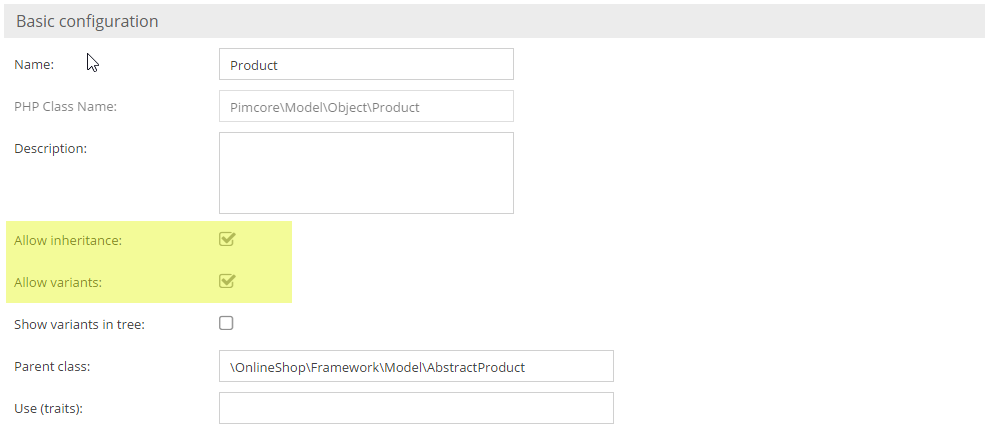

# Object Variants
The best way to show the use and function of object variants is via a use case:

Your goal is to store lots of products in Pimcore. Many of these products are variants of each other, for example a 
yellow t-shirt, a blue t-shirt, a red t-shirt etc. Most of the t-shirts' attributes have the same values and they 
just differ in color and EAN code.

One way to achieve this is to make a generic t-shirt object and then create for each variant a child object within the 
tree which inherits most attributes and sets only those which differ. This approach works fine, but if you have dozens or even hundreds of variants, your object tree becomes quite big and confusing.

This is where object variants come in. Basically, they are just objects which you can configure to be not shown in the object tree. In the tree, you just create the generic t-shirt. For each variant of this t-shirt, you create an object variant. While you can choose variants to not be shown in the tree, you will nevertheless be able to edit them via an own tab within the object editor.

The only difference between objects and variants in behaviour is that you cannot add an object of another class below a variant.

So, you can create hundreds of object variants without blowing your object tree.


As the normal object grid, the object variant grid supports paging, filtering, hiding of columns and visualization of 
inherited values. So even a big number of variants should be manageable.

## Create and organize Object Variants
To use object variants, they have to be activated in the class definition first. Object variants only make sense, 
if inheritance is activated. Therefore, inheritance is a requirement for object variants.



Once they are activated, the object editor has an additional tab 'Variants'. There, all variants of the current object 
are shown in a grid. Via buttons object variants can be created, opened and deleted.


To create object variants via code, just create a normal object, set as parent the generic t-shirt and set the object 
type to `DataObject\AbstractObject::OBJECT_TYPE_VARIANT`.

```php
$objectX = new DataObject\Product();
$objectX->setParent(DataObject\Product::getById(362603));
$objectX->setKey("variantname");
$objectX->setColor("black");
$objectX->setType(DataObject\AbstractObject::OBJECT_TYPE_VARIANT);
$objectX->save();
```

## Query Object Variants

#### Get all Object Variants of an object
Getting all variants of an object is quite simple. Just call `getChildren` and pass the wanted object types as an array. 
If only variants should be returned use following line.

```php
$objectX->getChildren([DataObject\AbstractObject::OBJECT_TYPE_VARIANT]);
```

By default, `getChildren` delivers objects and folders but no variants.


#### Object Variants in Object Lists

Similar to `getChildren`, the object list objects now have an object type property, which defines the object types to 
deliver. Per default objects and folders are delivered. To deliver object variants, use one of the following code 
snippets:

```php
$list = new DataObject\Product\Listing();
$list->setObjectTypes([DataObject\AbstractObject::OBJECT_TYPE_VARIANT]);
$list->load();

// or

DataObject\Product::getList([
    "objectTypes" => [DataObject\AbstractObject::OBJECT_TYPE_VARIANT]
]);
```

If you want regular objects and variants, you should use:

```php
$list = new DataObject\Product\Listing();
$list->setObjectTypes([DataObject\AbstractObject::OBJECT_TYPE_VARIANT,DataObject\AbstractObject::OBJECT_TYPE_OBJECT]);
$list->load();
```
