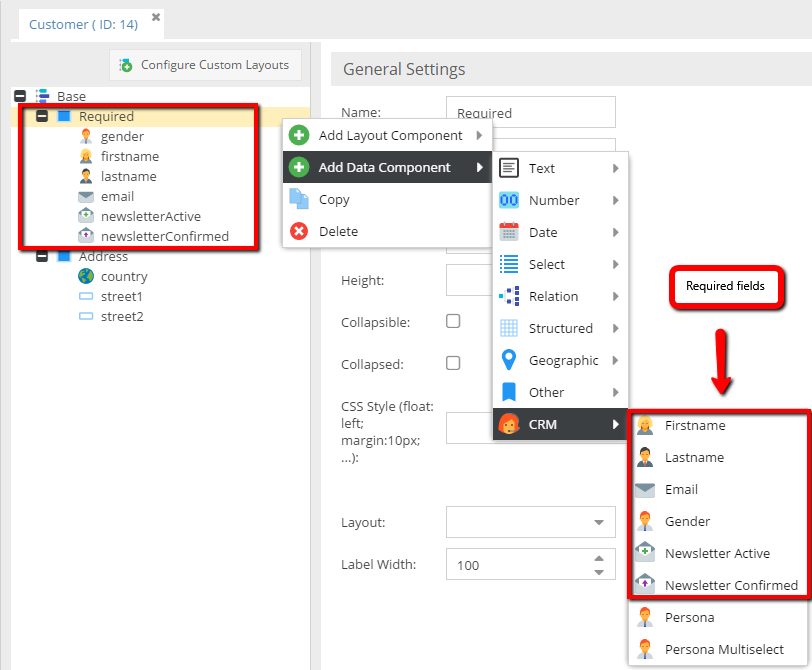
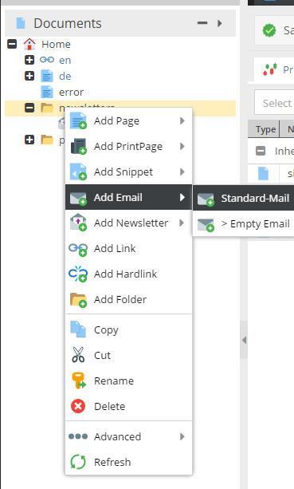
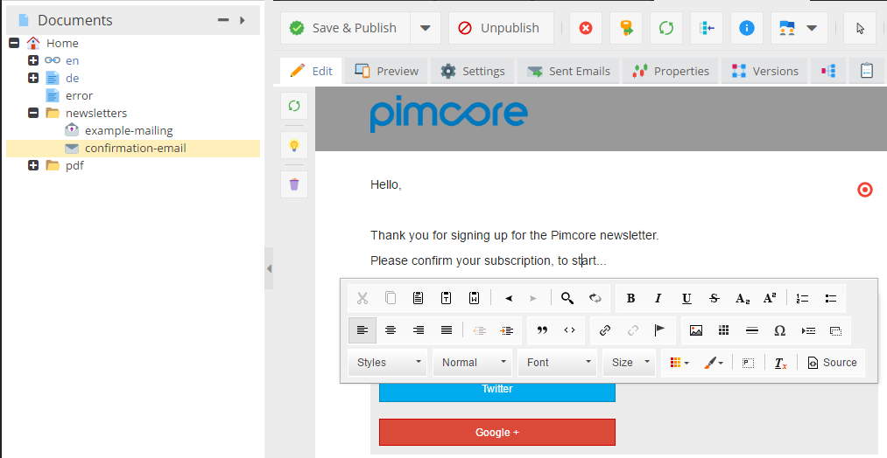
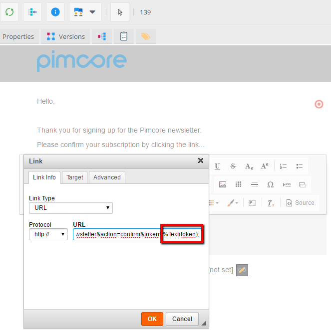
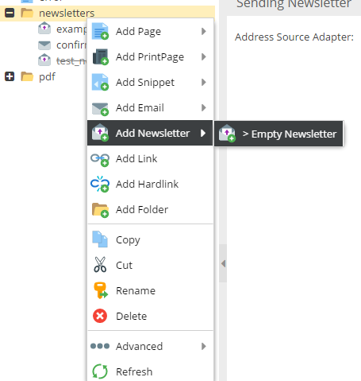
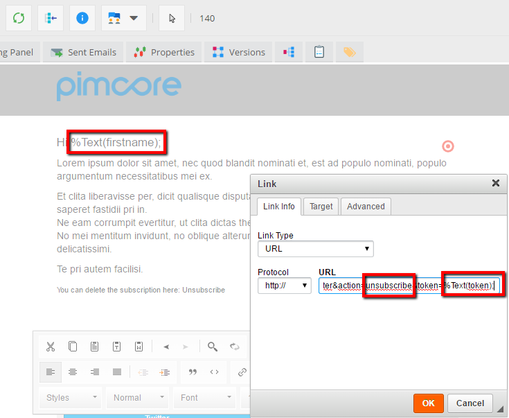
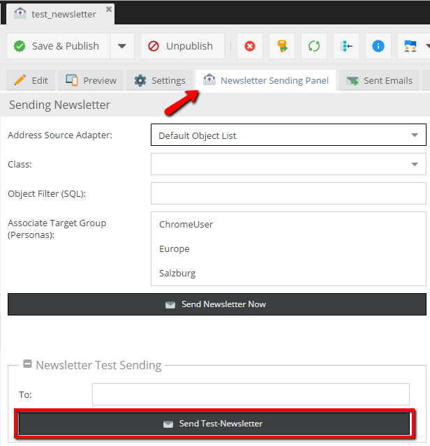
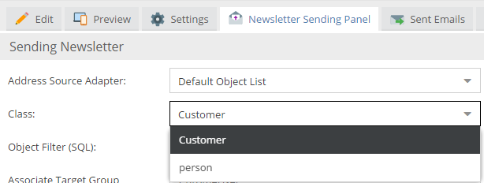

# Newsletter

## General

Pimcore provides a basic newsletter framework. 

The main advantage is that you can send completely customized / personalized newsletters by using all the data stored 
in the system (products, ...).
The content of the e-mail is rendered individually for every recipient (the user object is available in the action and view), 
this gives you the absolute freedom for your content.

The newsletter framework is just a wrapper for existing functionality in Pimcore. 
This makes it easy to use and gives you all the advantages Pimcore offers you. 

The newsletter content is assembled in an *Newsletter* document.
Therefore, your newsletter template is just a simple action and view. In the view you can use all features known 
from the other document types (page, snippets...).

As mentioned before, this document is rendered individually for every user, that makes it possible to include content 
depending on the user data.

If your *mailing list* is stored in objects, you can find few special data components for that case.  

## Basic Setup

**Class definition**

The class definition below shows how to build a class used by the newsletter list.
 


The purpose of the fields gender, *firstname*, *lastname* and *email* should be clear.
*newsletterActive* and *newsletterConfirmed* are used to save the state of the user (also used by the frontend framework). 
The *newsletterActive* data component tells the newsletter framework whether to send the newsletter to this user or not. 
The *newsletterConfirmed* component is used for double opt-in (provided by the frontend framework). 

**Only if newsletterActive and newsletterConfirmed are ticked the user in the object receives the newsletter.**

The *newsletterConfirmed* cannot be set in the admin interface, the reason is simple: the frontend framework logs every 
activity to *Notes & Events* including the IP etc. from the user, so it's possible to track every modification the user 
has made to his profile. 

Now if the editor is able to change this important setting the audit trail is pitted and it's not clear why the user 
receives the newsletter. 

Of course it's possible to change the value via API (eg. in importers).

### URL prefix for static assets

You are able to configure the default URL prefix in order to make sure, that your static assets
(e.g. images or CSS files) are getting prefixed correctly.

```yml
pimcore:
    documents:
        newsletter: 
            defaultUrlPrefix: 'https://my-host.com'
```

## Newsletter Frontend Framework

Once you have setup your data class, it's possible to use the newsletter frontend framework. 
This simple framework allows you to create a hassle free subscribe/confirm/unsubscribe workflow.
 
## Example
 
### Controller

For example, `\NewsletterController`: `src/AppBundle/Controllers/NewsletterController.php`

```php
<?php

namespace AppBundle\Controller; 

use Pimcore\Controller\FrontendController;
use Pimcore\Model;
use Pimcore\Tool\Newsletter;
use Symfony\Component\HttpFoundation\Request;


class NewsletterController extends FrontendController
{
    public function subscribeAction(Request $request)
    {
        $newsletter = new Newsletter("person"); // replace "person" with the class name you have used for your class above (mailing list)
        $params = $request->request->all();

        $this->view->success = false;

        if ($newsletter->checkParams($params)) {
            try {
                $params["parentId"] = 1; // default folder (home) where we want to save our subscribers
                $newsletterFolder = Model\DataObject\AbstractObject::getByPath("/crm/newsletter");
                if ($newsletterFolder) {
                    $params["parentId"] = $newsletterFolder->getId();
                }

                $user = $newsletter->subscribe($params);

                // user and email document
                // parameters available in the email: gender, firstname, lastname, email, token, object
                // ==> see mailing framework
                $newsletter->sendConfirmationMail($user, Model\Document::getByPath("/en/advanced-examples/newsletter/confirmation-email"), ["additional" => "parameters"]);

                // do some other stuff with the new user
                $user->setDateRegister(new \DateTime());
                $user->save();

                $this->view->success = true;
            } catch (\Exception $e) {
                echo $e->getMessage();
            }
        }
    }

    public function confirmAction(Request $request)
    {
        $this->view->success = false;

        $newsletter = new Newsletter("person"); // replace "person" with the class name you have used for your class above (mailing list)

        if ($newsletter->confirm($request->get("token"))) {
            $this->view->success = true;
        }
    }

    public function unsubscribeAction(Request $request)
    {
        $newsletter = new Newsletter("person"); // replace "person" with the class name you have used for your class above (mailing list)

        $unsubscribeMethod = null;
        $success = false;

        if ($request->get("email")) {
            $unsubscribeMethod = "email";
            $success = $newsletter->unsubscribeByEmail($request->get("email"));
        }

        if ($request->get("token")) {
            $unsubscribeMethod = "token";
            $success = $newsletter->unsubscribeByToken($request->get("token"));
        }

        $this->view->success = $success;
        $this->view->unsubscribeMethod = $unsubscribeMethod;
    }
}
```

### Views

The subscribe action view: `app/Resources/views/Newsletter/subscribe.html.php`

```php
<?php
/**
 * @var \Pimcore\Templating\PhpEngine $this
 * @var \Pimcore\Templating\PhpEngine $view
 * @var \Pimcore\Templating\GlobalVariables $app
 */

$this->extend('layout.html.php');

?>

<?= $this->template('Includes/content-default.html.php') ?>

<?php if(!$this->success) { ?>

    <?php if($this->getParam("submit")) { ?>
        <div class="alert alert-danger">
            <?= $this->translate("Sorry, something went wrong, please check the data in the form and try again!"); ?>
        </div>
        <br />
        <br />
    <?php } ?>

    <form class="form-horizontal" role="form" action="" method="post">
        <div class="form-group">
            <label class="col-lg-2 control-label"><?= $this->translate("Gender"); ?></label>
            <div class="col-lg-10">
                <select name="gender" class="form-control">
                    <option value="male"<?php if($this->getParam("gender") == "male") { ?> selected="selected"<?php } ?>>Male</option>
                    <option value="female"<?php if($this->getParam("gender") == "female") { ?> selected="selected"<?php } ?>>Female</option>
                </select>
            </div>
        </div>
        <div class="form-group">
            <label class="col-lg-2 control-label"><?= $this->translate("Firstname"); ?></label>
            <div class="col-lg-10">
                <input name="firstname" type="text" class="form-control" placeholder="" value="<?= $this->escape($this->getParam("firstname")); ?>">
            </div>
        </div>
        <div class="form-group">
            <label class="col-lg-2 control-label"><?= $this->translate("Lastname"); ?></label>
            <div class="col-lg-10">
                <input name="lastname" type="text" class="form-control" placeholder="" value="<?= $this->escape($this->getParam("lastname")); ?>">
            </div>
        </div>
        <div class="form-group">
            <label class="col-lg-2 control-label"><?= $this->translate("E-Mail"); ?></label>
            <div class="col-lg-10">
                <input name="email" type="text" class="form-control" placeholder="example@example.com" value="<?= $this->escape($this->getParam("email")); ?>">
            </div>
        </div>

        <br />

        <div class="form-group">
            <div class="col-lg-offset-2 col-lg-10">
                <input type="submit" name="submit" class="btn btn-default" value="<?= $this->translate("Submit"); ?>">
            </div>
        </div>
    </form>
<?php } else { ?>
    <div class="alert alert-success"><?= $this->translate("Success, Please check your mailbox!"); ?></div>
<?php } ?>
```

The confirm action view: `app/Resources/views/Newsletter/confirm.html.php`

```php
<?php
/**
 * @var \Pimcore\Templating\PhpEngine $this
 * @var \Pimcore\Templating\PhpEngine $view
 * @var \Pimcore\Templating\GlobalVariables $app
 */
?>


<?php if(!$this->success) { ?>
    <div class="alert alert-danger">
        <h2><?= $this->translate("Sorry, something went wrong, please sign up again!"); ?></h2>
    </div>
<?php } else { ?>
    <div class="alert alert-success">
        <h2><?= $this->translate("Thanks for confirming your address!"); ?></h2>
    </div>
<?php } ?>


```

The unsubscribe action view: `app/Resources/views/Newsletter/unsubscribe.html.php`

```php
<?php
/**
 * @var \Pimcore\Templating\PhpEngine $this
 * @var \Pimcore\Templating\PhpEngine $view
 * @var \Pimcore\Templating\GlobalVariables $app
 */

$this->extend('layout.html.php');

?>

<?= $this->template('Includes/content-default.html.php') ?>

<?php if(!$this->success) { ?>

    <?php if ($this->unsubscribeMethod) { ?>
        <div class="alert alert-danger">
            <?php if ($this->unsubscribeMethod == "email") { ?>
                Sorry, we don't have your address in our database.
            <?php } else { ?>
                Sorry, your unsubscribe token is invalid, try to remove your address manually:
            <?php } ?>
        </div>
    <?php } ?>


    <form class="form-horizontal" role="form" action="" method="post">

        <div class="form-group">
            <label class="col-lg-2 control-label"><?= $this->translate("E-Mail"); ?></label>
            <div class="col-lg-10">
                <input name="email" type="text" class="form-control" placeholder="example@example.com" value="<?= $this->escape($this->getParam("email")); ?>">
            </div>
        </div>

        <br />

        <div class="form-group">
            <div class="col-lg-offset-2 col-lg-10">
                <input type="submit" name="submit" class="btn btn-default" value="<?= $this->translate("Submit"); ?>">
            </div>
        </div>
    </form>
<?php } else { ?>
    <div class="alert alert-success">
        <h2>Unsubscribed</h2>
    </div>
<?php } ?>

```

### Confirmation E-Mail

The confirmation e-mail (See: `\Pimcore\Tool\Newsletter::sendConfirmationMail`) is a simple e-mail document.

In this document the following [placeholders](../19_Development_Tools_and_Details/23_Placeholders/02_Text_Placeholder.md) are available:

* %Text(firstname);
* %Text(lastname);
* %Text(token);
* %Text(email);
* %Text(gender);

and:

```
%Object(object,{"method" : "someMethod"});
```

(See the [Object placeholder section](../19_Development_Tools_and_Details/23_Placeholders/01_Object_Placeholder.md))

In the document editmode you can create the confirmation email by choosing **Add email -> Standard-Mail**:



The editmode is of course quite similar to other document types:




To define the confirmation URL in editmode. You have to add controller / action and token information.
In the picture, you can see how you would add a token placeholder to the URL. 




### Sending Newsletters

#### Create a Newsletter Document

To send a newsletter you need an email document, which is used as content for the newsletter (nothing special to consider).
 
In this document the following placeholders are available:
 
* %Text(firstname);
* %Text(lastname);
* %Text(token);
* %Text(email);
* %Text(gender);
* %Object(object,{"method" : "someMethod"});

(See the [Object placeholder section](../19_Development_Tools_and_Details/23_Placeholders/01_Object_Placeholder.md))



#### Get UserData in the Email Template

```php
$userObject = $this->getParam('object');
$firstname = $userObject->getFirstname();
$lastname = $userObject->getLastname();

...
```

In the example below, you can find out how to add the unsubscribe link and how to use firstname in the content.



### Send a Test Message

In newsletter documents, there is additional tab in the top panel, it's called *Newsletter Sending Panel*.
It's a good practise to check newsletter before it would be used with real emails. 



### Send the Newsletter

To send the newsletter you have to specify a source adapter.
We're going to use customer objects as a source, therefore we need to choose the *Default object list* adapter.
And the *Customer* class as the source.

Choose the adapter:


Choose the class:



and at the end, just push the **Send Newsletter Now** button.
