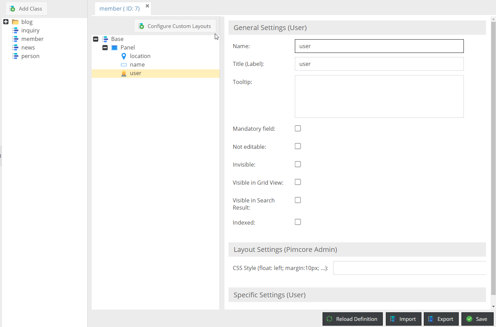
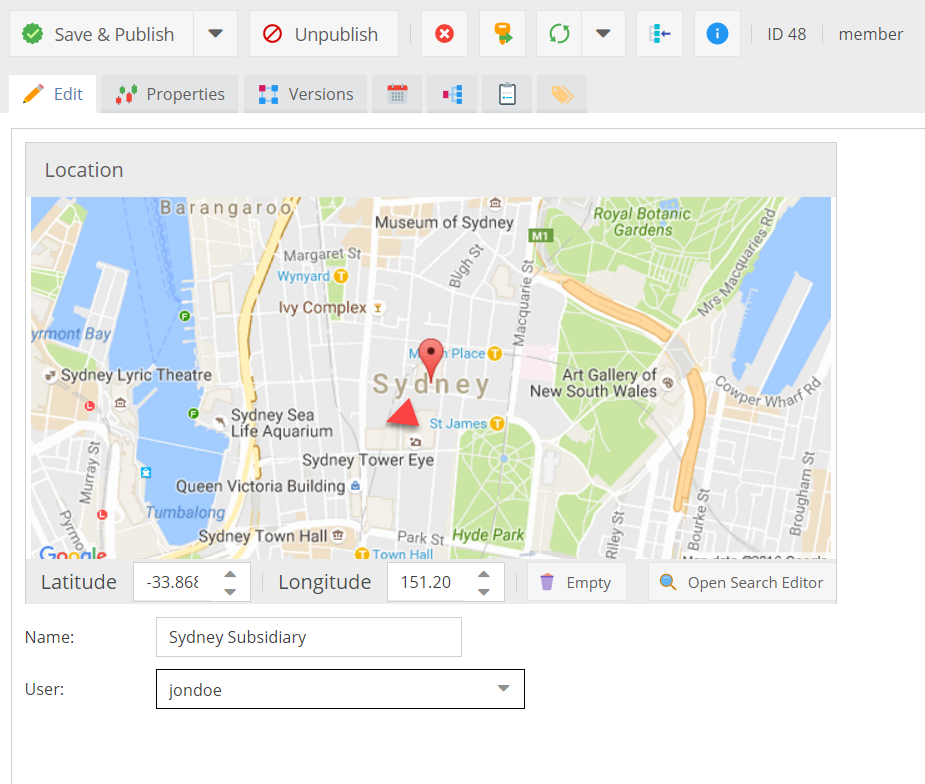

# Extending the Pimcore User

Pimcore does not allow to extend the user directly. Instead it allows to create a relation 
between a user and one or more Pimcore objects. This can be used to add information to a user 
or to associate one or more objects directly with a system user. 

This article presents an example where the `member` object is associated with a Pimcore user. 
The screenshots show how this can be achieved through the Pimcore backend UI. In the bottom 
there is also an example of how the user and member objects can be created and associated 
with each other programmatically.

Regardless of the creation method of users and objects, in the first step the member class 
has to be defined in *Settings* > *Object* > *Classes*:



In this example, the class `member` has the three properties `location`, `name` and `user`. 
The class can have an arbitrary number of properties. What is important in this context is, 
that it has a property of the type `User`. Speaking in code this would be a 
`\Pimcore\Model\DataObject\ClassDefinition\Data\User`.

When creating the first object instance of the member class, you can see the input widget 
for the user property. It is a combo box where a user can be selected from all available 
Pimcore users.



In this example the user "jondoe" was selected.

In the *Settings* > *Users* panel this relation is portrayed in the third tab of each 
user which is called `This user is referenced in the following objects:`


Objects and users are not necessarily always created through user input in the admin interface.
Sometimes these objects are created programmatically in the context of importers. The 
following code snippet shows how to first create the user and then the member object with 
the relation to the previously created user:

```php
use Pimcore\Model\User;
use Pimcore\Model\DataObject;
...
 
//create a new user for Sydney
$user = User::create([
    "parentId" => intval($userGroup->getId()),
    "username" => "sydney",
    "password" => "password1234",
    "hasCredentials" => true,
    "active" => true
]);
 
...
 
//create the Sydney member object
$object = new DataObject\Member();
$object->setCreationDate(time());
$object->setUserOwner($currentUser->getId());
$object->setUserModification($currentUser->getId());
$object->setPublished(true);
 
$object->setName("Sydney Subsidiary");
$object->setKey("member1234");
//select the user belonging to this object
$object->setUser($user->getId());
 
$object->setParentId($parentFolderId);
$object->save();
 
...
```

Aside from creating these objects, one might need to find out what objects are associated with a certain user. 
There is a convenient method available to find all objects associated with a specific user:

```php
$objects = \Pimcore\Model\DataObject\Service::getObjectsReferencingUser($userId);
```
