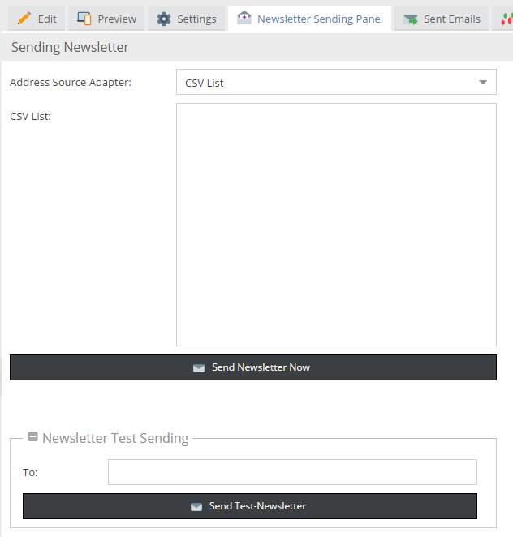

# Newsletter Document

Newsletter documents are the way to create and send newsletters directly within Pimcore. 
They are based on the normal Pimcore documents and therefore support everything as pages do - starting from MVC pattern 
and template creation to document composing within Pimcore backend with areas, drag&drop etc. 


## Additional Settings
Newsletter documents provide following additional settings compared to default documents:


  - Subject: Subject of the newsletter.
  - From: From-Address of the newsletter. As fallback, Pimcore system settings are used. 
  - Add Tracking Parameters to Links: Adds tracking parameters to all links within the newsletter. 
  - Tracking Parameter 'Source', 'Medium', 'Name': Values for the tracking parameters. 
  - Sending Mode: 
     - Single (Render every Mail individually): Document is rendered for each recipient - necessary for individual newsletters. 
     - Batch (Render Mail only once): Document is rendered once - no individual newsletters possible, but faster. 


## Newsletter Sending
The Newsletter Sending Panel provides the functionality for sending the newsletter. 


### Address Source Adapter
The Address Source Adapter is responsible for extracting the email addresses the newsletter should be sent to. It has to 
be selected before another action can take place. Currently following adapters ship with Pimcore. It is easily possible 
to integrate custom adapters - see section below.
- Default Object List: Extracts email addresses based on Pimcore objects.  
- CSV List: Uses a CSV as source for email addresses. 
- Column from a report: Uses a custom report as source for email adresses. 

### Test Sending
Once a Address Source Adapter is selected, a test sending to a specified email address can be made with the button 
`Send Test-Newsletter`. 

### Sending the Newsletter
With `Send Newsletter Now` the newsletter is sent to all recipients. The sending itself is done based on the system 
settings of Pimcore. There you also can configure an external SMTP sending service for mass mail sending. 


## Creating a Custom Address Source Adapter
It is easily possible to implement custom address source adapter. Following files have to be created: 
- JavaScript Class: This class defines the user interface in the sending panel. It has to be located in 
the namespace `pimcore.document.newsletters.addressSourceAdapters`, named like the adapter (e.g. `pimcore.document.newsletters.addressSourceAdapters.myAdapter`)
 and implement the methods `initialize`, `getName`, `getLayout` and `getValues`. As sample see [csvList](https://github.com/pimcore/pimcore/blob/master/bundles/pimcoreadmin/js/pimcore/document/newsletters/addressSourceAdapters/csvList.js)
- PHP Class: This class is the server side implementation of the adapter. It is responsible for retrieving and preparing 
the email addresses. It needs to implement the interface `AddressSourceAdapterInterface`. As sample see
 [csvList](https://github.com/pimcore/pimcore/blob/master/lib/Document/Newsletter/AddressSourceAdapter/CsvList.php).
- Register your Adapter Source Factory as Service. If you are using a very simple Adapter Source, you can use the DefaultFactory
  ```yml
  app.document.newsletter.factory.myAdapter:
      class: Pimcore\Document\Newsletter\DefaultAddressSourceAdapterFactory
      arguments:
        - 'App\Document\Newsletter\AddressSourceAdapter\MyAdapter'
  ```
- If you are using a more complex Source Adapter, you can create your own Factory by implementing the interface Pimcore\Document\Newsletter\AddressSourceAdapterFactoryInterface
- Add your Adapter Factory to the configuration:

```yml
pimcore:
    newsletter:
        source_adapters:
            myAdapter: app.document.newsletter.factory.myAdapter

```


