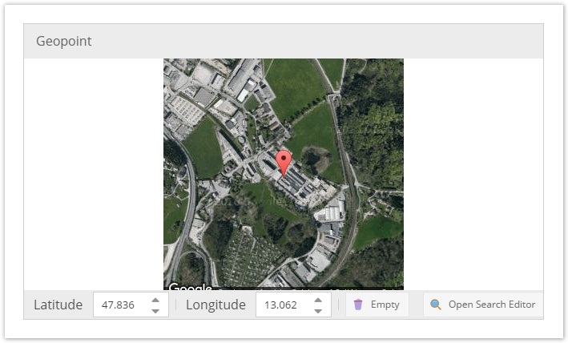
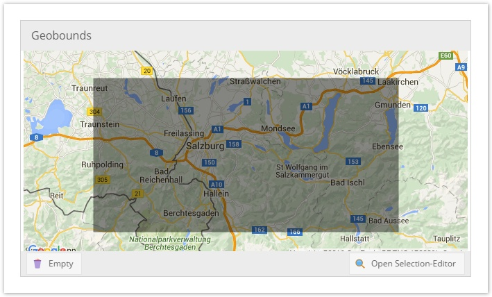
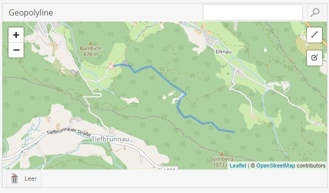

# Geographic Datatypes

There are different geographic data types available in pimcore: `Geopoint`, `Geobounds`, `Geopolygon` and `Geopolyline`. 
The country select box also belongs to the context of geo widgets, but it is rather a select input widget and therefore it is 
listed with the other select widgets.


## Geopoint




The geopoint consists of two coordinates: latitude and longitude. In the Pimcore GUI there is the same geopoint selector 
widget as shown above. It allows to find coordinates for a geographic point easily. In the database the values are 
stored in two columns which are called latitude and longitude. Programmatically the data for this field is 
represented by `Pimcore\Model\DataObject\Data\Geopoint`. To set a geopoint programmatically, a new 
`Pimcore\Model\DataObject\Data\Geopoint` has to be instantiated:

```php
$longitude = 107.6191228;
$latitude = -6.9174639;
$point = new \Pimcore\Model\DataObject\Data\GeoCoordinates($latitude, $longitude);
$object->setPoint($point);
$object->save();
```


## Geobounds



Geobounds represent a geographic area defined by a north eastern point and a south western point. In the pimcore GUI the 
input widget as shown above is available. In the database there are 4 columns with coordinates to hold the data of 
geobounds. Programmatically both points are `Pimcore\Model\DataObject\Data\Geopoints` and they are wrapped by the 
`Pimcore\Model\DataObject\Data\Geopoints` Object. The following code snippet shows how to set Geobounds:

```php
use Pimcore\Model\DataObject\Data\Geobounds;
use Pimcore\Model\DataObject\Data\Geopoint;
 
$northEast = new \Pimcore\Model\DataObject\Data\GeoCoordinates(150.96588134765625, -33.704920213014425);
$southWest = new \Pimcore\Model\DataObject\Data\GeoCoordinates(150.60333251953125, -33.893217379440884);
$object->setBounds(new Geobounds($northEast,$southWest));
$object->save();
```


## Geopolygon


The geopolygon is the third in the row of geo widgets. It allows to define a geographic area by setting an arbitrary 
amount of geo points. In the database these points are stored in a single column of the data type LONGTEXT in the 
form of a serialized array of `Pimcore\Model\DataObject\Data\Geopoints`. To set geopolygon data programmatically, an 
array of Geopoints has to be passed to the setter:

```php
use Pimcore\Model\DataObject\Data\Geopoint;
  
$data = [
    new \Pimcore\Model\DataObject\Data\GeoCoordinates(-33.464671118242684, 150.54428100585938),
    new \Pimcore\Model\DataObject\Data\GeoCoordinates(-33.913733814316245, 150.73654174804688),
    new \Pimcore\Model\DataObject\Data\GeoCoordinates(-33.9946115848146, 151.2542724609375)
];
$object->setPolygon($data);
$object->save();
```

## Geopolyline



It allows to define a geographic path by setting an arbitrary amount of geo points. In the database these points are 
stored in a single column of the data type LONGTEXT in the form of a serialized array of 
`Pimcore\Model\DataObject\Data\Geopoints`. To set geopolygon data programmatically, an array of Geopoints has to be 
passed to the setter:

```php
use Pimcore\Model\DataObject\Data\Geopoint;
  
$data = [
    new \Pimcore\Model\DataObject\Data\GeoCoordinates(-33.464671118242684, 150.54428100585938),
    new \Pimcore\Model\DataObject\Data\GeoCoordinates(-33.913733814316245, 150.73654174804688),
    new \Pimcore\Model\DataObject\Data\GeoCoordinates(-33.9946115848146, 151.2542724609375)
];
$object->setPolyline($data);
$object->save();
```
