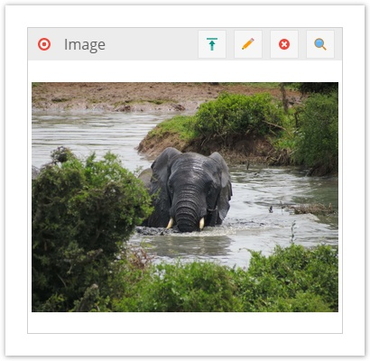
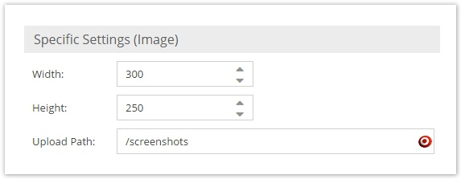
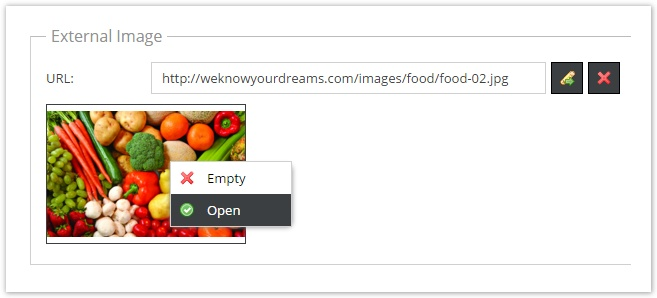
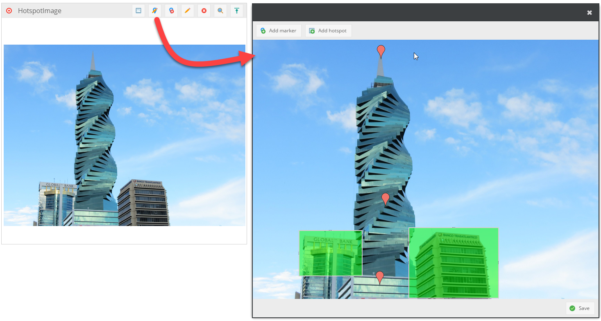

# Image Datatypes

## Image



An image field is stored in an INT column in the database. It holds the ID of the referenced `\Pimcore\Model\Asset\Image`. 
Unlike other object relation types, an image relation is not stored in the relations table (this has historic reasons), 
but it creates a dependency in the dependencies table.

To set an object's image field programmatically, an `\Pimcore\Model\Asset\Image` must be passed to the according setter.

```php
$image = Asset\Image::getByPath("/examples/example1.jpg");
$object->setImage($image);
$object->save();
```

The image field is represented in the UI by an image drop area. The image drop area's width and height can be configured 
in the class settings as follows:




#### Working with images in frontend
The get a thumbnail of an image field, just call `getThumbnail()` on the returned asset object.

```twig

    {{ object.myImage.thumbnail('myThumbnailDefinitionName').html }}

```

Since `$object->getImage()` just returns an asset object, you can of course use all other thumbnail features of `Pimcore\Model\Asset\Image`.


## External Image

This one allows you to enter an external image URL which is then shown as a preview.



```twig

    

```

## Image Gallery

Is a collection of `Advanced Images` (see below). The sort order can be changed via drag & drop.

 

Populate an ImageGallery

```php
<?php

$galleryData = [
	AssetImage,
	AssetImage,
	//....
];

$items = [];
foreach($galleryData as $img){

   $advancedImage = new \Pimcore\Model\DataObject\Data\Hotspotimage();
   $advancedImage->setImage($img);
   $items[] = $advancedImage;
}

$news->setGallery(new \Pimcore\Model\DataObject\Data\ImageGallery($items));

?>
```

## Image Advanced (supporting Hotspots/Markers/Cropping)

This data type is an advanced extension to the image data type which allows defining hotspots, markers and cropping on 
the assigned image.



The hotspots are defined by a name and are stored as an array with the attributes name, top, left, width and height 
whereas the values top, left, width, height are stored as percentages of the image dimensions.

#### Get Hotspots

To access the hotspots programmatically, following code snipped can be used.

```php
$hotspotImage = $object->getHotspot1(); // name of the field in Pimcore is "hotspot1" in this case (class definition)
 
//get the assigned Asset\Image
$image = $hotspotImage->getImage();
 
//get an array of all defined hotspots
$hotspots = $hotspotImage->getHotspots();
```

The content of `$hotspots` could look like:

```
Array
(
    [0] => Array
        (
            [name] => hotspot1
            [top] => 3.8922155688623
            [left] => 48.076923076923
            [width] => 8.3333333333333
            [height] => 48.802395209581
        )
 
    [1] => Array
        (
            [name] => hotspot2
            [top] => 8.9820359281437
            [left] => 70.897435897436
            [width] => 14.230769230769
            [height] => 44.011976047904
        )
 
)
```
This information can be used in the frontend to visualize the hotspots.


#### Get Markers

For markers this is completely the same procedure:
 
```php
$hotspotImage = $object->getHotspot1(); // name of the field in Pimcore is "hotspot1" in this case (class definition)
//get an array of all defined marker
$marker = $hotspotImage->getMarker();
```

The content of $marker could look like:

```
Array
(
    [0] => Array
        (
            [top] => 3.8922155688623
            [left] => 48.076923076923
        )
 
    [1] => Array
        (
            [top] => 8.9820359281437
            [left] => 70.897435897436
        )
 
)
```


#### Get the cropped image

To get the cropped image you have to use the `getThumbnail()` method:

```php
$hotspotImage = $object->getHotspot1(); // name of the field in Pimcore is "hotspot1" in this case (class definition)
 
echo $hotspotImage->getThumbnail(); // this example returns the image cropped with the original dimensions
 
echo $hotspotImage->getThumbnail("myCustomThumbnail"); // this example returns the cropped thumbnail according to the configuration (similar to document's $this->image())
```

#### Thumbnail of image

Of course you can use the above code regardless if the image is cropped or not:

```php
$hotspotImage->getThumbnail("myCustomThumbnail"); // $hotspotImage contains no cropping information, the thumbnail is returned as usual (see $assetImage->getThumbnail("..."); )
```

#### Populate the advanced image type

```php
$image = Asset::getById(123);
$advancedImage = new DataObject\Data\Hotspotimage();
$advancedImage->setImage($image);
// ...
 
$object->setMyAdvancedImage($advancedImage);
```

#### Predefined Data Templates

In addition to the empty standard data template you can provide a JSON config in the classdefinition describing additional custom templates.
These will show up as split button entries in the "add marker/add hotspot" menu.

```json
{
	"marker": [{
		"menuName": "marker config 1",
		"name": "hotspot name",
		"data": [{
			"name": "my asset href",
			"type": "asset",
            "value": "/screenshots/glossary.png"
		}, {
			"name": "my textfield",
			"type": "textfield"
		}]
	}],
	"hotspot": [{
		"menuName": "hotspot config 1"
	}]
}
```


