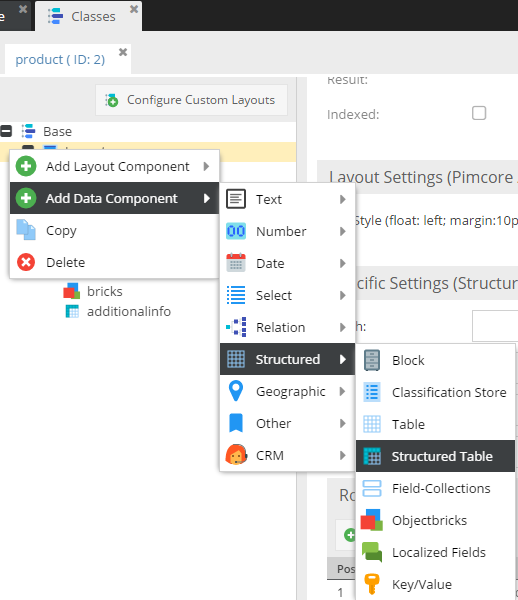
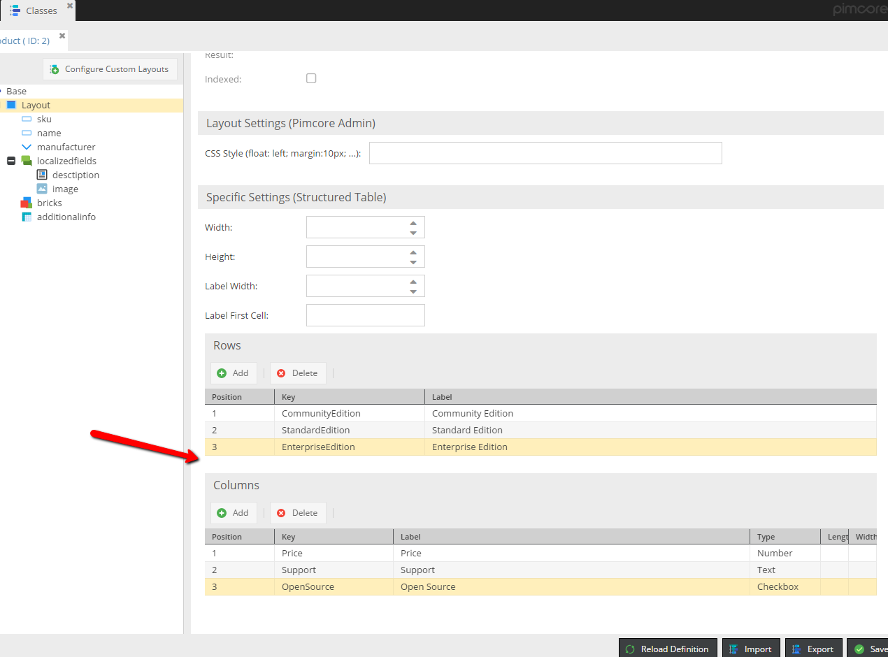

# Structure table

## Add structure table to the class

Similar to the table widget, the structured table can hold structured data. 
But there are a few fundamental differences:

* The rows and columns are predefined and named.
* The data type per column can be defined. Possible data types are text, number and boolean.
* The data of a structured table can be accessed via getters and setters and is stored in a structured way in the database.

You can add structured table component in a class definition:



To define the table, you have to specify rows and columns headers which would be used to fill the structured table content.



Now, you can use the table in your object, like below:


## Storage of Structured tables

For each row and column combination a new column in table of the structured table containing class will be stored.

So it will be a clear restriction not to use this type of structuring data in case of a bigger number of data rows or columns. By using this design the maximum number of columns per table should be taken into consideration because it could be a technical restriction for it.

## Using structured table with PHP API

In the code, the data of this field can be accessed as shown in the code snippets, below:

```php
/** @var \Pimcore\Model\DataObject\Data\StructuredTable $structuredData */
$structuredData = $object->getAdditionalinfo();

//Returns an associated array of row CommunityEdition with all columns
$structuredData->getCommunityedition();

//Returns an associated array of row CommunityEdition with all columns
$structuredData->getCommunityedition__support();

//Delivers an associated array of row CommunityEdition with all columns
$structuredData->setCommunityedition__support("Forum");

//Alternative way of setting data to a structured table
$data = [];
$data['communityedition']['opensource'] = true;
$structuredData->setData($data);
```

## Using copy and paste feature in an object using table data type

A copy and paste feature is available to be able to fill easily the table in an object from an Excel sheet for instance:


It is possible to copy directly data in the OS clipboard from Excel:


And after pasting data will be formatted keeping Excel structure:


You can paste any data (from text files, etc.), separator must be tabulation.
